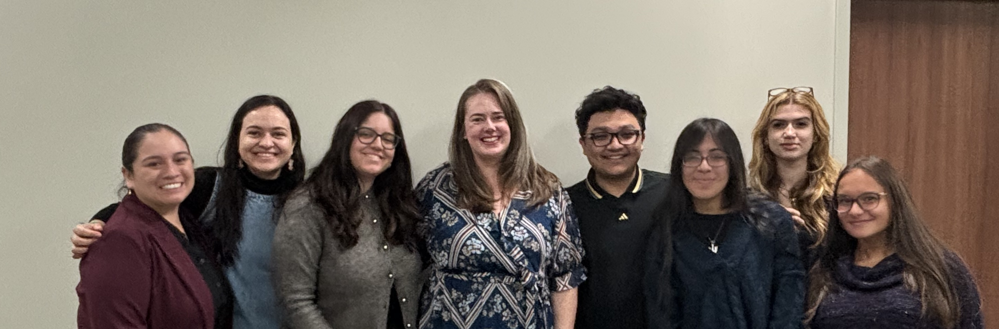

 

  <!-- Mission Column -->
  

  <h2 style="color: #593196; margin-top: 0;">Who are we?</h2>
  

  We are a group of graduate and undergraduate students, lead by Principal Investigator [Dr. Kendra V. Dickinson](kvdickinson.com), Assistant Professor in the Department of Spanish and Portuguese at Rutgers University. To learn more about current and former members, visit [People](people.qmd).
   

   
    
    
  <h2 style="color: #593196; margin-top: 0;">What is our mission?</h2>

  

    <a href="https://www.pbs.org/video/sociolinguistics-lusa55/" target="_blank">
      Sociolinguistics
    </a> 
    is a field that investigates the relationship between language and society. 
    At the SlAnG, we are dedicated to advancing understanding of language variation 
    and change as it intersects with our social world. Our work utilizes a range 
    of quantitative, qualitative, experimental, and production-based methods to 
    uncover the hidden patterns of how language is used, acquired, and perceived 
    in everyday life.
  

  

  <!-- Goals Column -->
  

  <h2 style="color: #593196; margin-top: 0;">What are our goals?</h2>

  <ul class="numbered-list">
    <li data-number="1">
      Conduct collaborative research investigating the linguistic, social, and cognitive underpinnings of language variation and change.
    </li>

    <li data-number="2">
      Create a corpus of Spanish as it is spoken in central New Jersey.
    </li>

    <li data-number="3">
      Raise awareness about language diversity and challenge linguistic discrimination through education and outreach.
    </li>

    <li data-number="4">
      Support undergraduate and graduate students through mentorship in ethical, data-driven linguistic research.
    </li>

    <li data-number="5">
      Build a vibrant community of scholars and students interested in the intersections of language and society at Rutgers University and beyond.
    </li>
  </ul>

  

    

## Recent Updates
