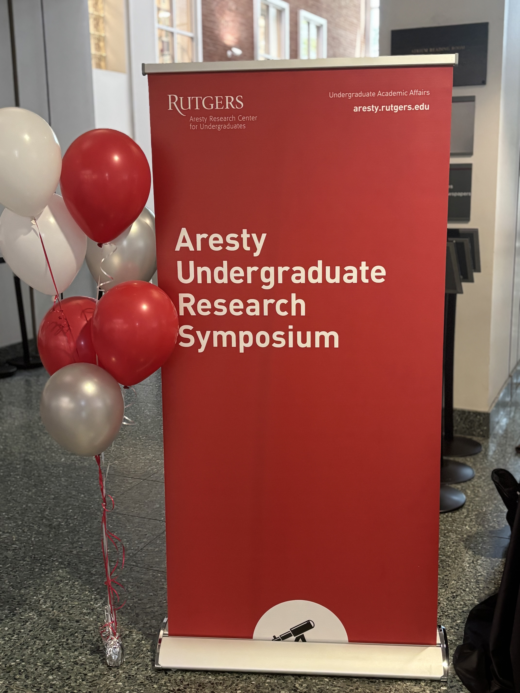
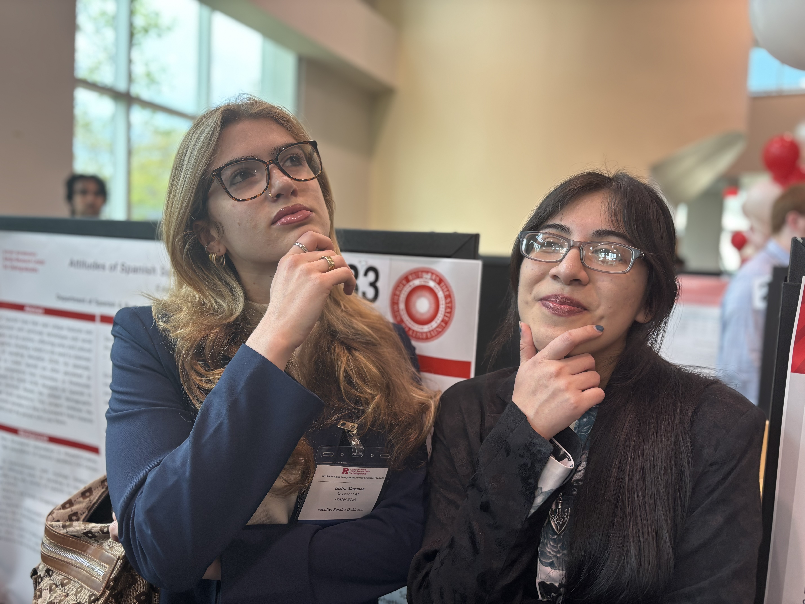

On April 24th, 2026, our Aresty Undergraduate Research Assistants Giovanna Licitra and Eden Calix presented their original research at the [22nd Annual Undergraduate Research Symposium](https://aresty.rutgers.edu/research-showcase/undergraduate-research-symposium) at the Alexander Library.

:::::: {style="max-width: 800px; margin: 0 auto;"}
::::: columns
::: {.column width="50%"}
{width="100%," style="padding-right: 20px;"}
:::

::: {.column width="50%"}
{width="100%;" style="padding-left: 20px;"}
:::
:::::
::::::

   

For their project, *Attitudes of Spanish Speakers in New Brunswick*, Eden explored how different varieties of Spanish are perceived within the local community. Their findings show that speakers are attuned to the distinct qualities of different dialects, often describing them in terms of sound and style—for example, contrasting ways of speaking as *golpeado* (‘harsh’) versus *cantado* (‘sing-songy’), or noting recognizable accents and region-specific vocabulary.

At the same time, Eden found that dialects are closely tied to identity. Many participants emphasized that people should continue speaking their own variety to maintain their roots, even when those varieties are sometimes viewed as less “proper.” While some speakers expressed beliefs about correctness, there was also a underlying recognition that “*en realidad...todos hablamos español*" ('in reality...we all speak Spanish'), pointing to linguistic unity across variation. Overall, Eden's project highlights the tension between ideas of standard language and the lived reality of dialect diversity, offering an important first look at how Spanish speakers in New Brunswick navigate issues of identity, difference, and belonging through language.

    

For her project, *Mind the Gap: Social Conditioning of Hesitation Markers among Spanish-English Bilinguals in New Brunswick*, Giovanna examined how even subtle aspects of speech, such as like hesitation sounds (e.g., "eh...", "uhm..."), can reflect the influence of bilingualism and social experience. Drawing on sociolinguistic interview data, she analyzed how speakers produce filled pauses and whether these patterns shift under contact with English.

Her findings show a clear pattern of phonological convergence: speakers with greater exposure to English, measured through factors like percentage of life spent in the U.S. and age of arrival, were more likely to use the centralized vowel \[ə\], which is typical of English filled pauses, rather than the more traditional Spanish \[e\]. In fact, speakers with the highest exposure produced English-like vowels in a substantial portion of their pauses, while those with less exposure used them rarely.

Overall, Giovanna’s project highlights that even seemingly “automatic” features of speech are socially conditioned. This study represents preliminary work that will continue to be developed in the lab, demonstrating how bilingual experience shapes pronunciation in subtle but systematic ways. In doing so, it offers new insight into how Spanish is evolving through contact with English in New Brunswick and similar communities.

**Congratulations, Eden and Giovanna!**

:::::: {style="max-width: 800px; margin: 0 auto;"}

::::: columns
::: {.column width="50%"}
{width="100%," style="padding-right: 20px;"}
:::

::: {.column width="50%"}
{width="100%;" style="padding-left: 20px;"}
:::
:::::

::::::
