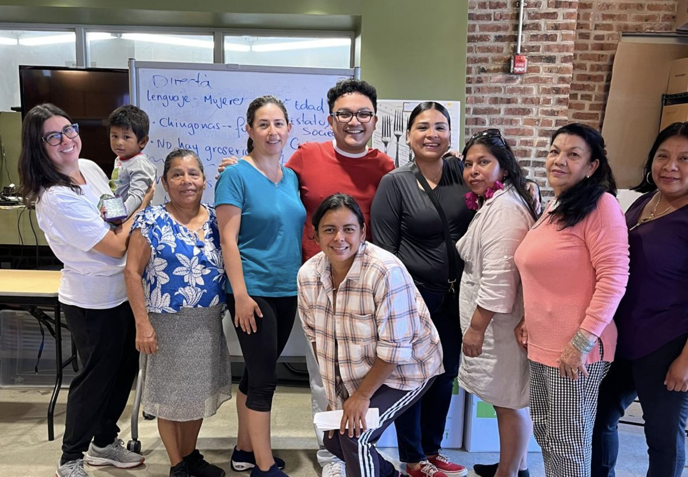

We are delighted to announce that third-year graduate student Yhosep Barba Blanco has been awarded the prestigious [Chancellor's Leadership Award](https://grad.rutgers.edu/funding/fellowships-grants).

This recognition is awarded annually to a graduate student from the Rutgers New Brunswick campus who "exemplifies excellence and truly embodies a commitment to leadership and involvement on campus and/or in the community". Furthermore, the awardee's record must demonstrate "that they have served in multiple campus leadership positions throughout their academic journey, having left a positive and lasting impression on the community through initiating, leading or supporting projects of activism or advocacy for social justice, inclusion, and diversity in unique and innovative ways".

Yhosep Barba Blanco exemplifies the criteria for the Chancellor’s Leadership Award through his involvement both on campus and in the broader New Brunswick community. Over the past three years, he has held multiple leadership positions, including Co-President of [RUBilingual](https://rubilingual.weebly.com/leadership-team.html), Assistant Director of the Spanish Language Program in the [Department of Spanish and Portuguese](https://span-port.rutgers.edu/), and organizer of community-based ESL and sociolinguistic initiatives in partnership with organizations such as the Unity Square Community Center and the Mexican Consulate. His work demonstrates measurable impact through the creation of workshops, curriculum redesign initiatives, and volunteer-led ESL tutoring that have reached hundreds of community members and students. Grounded in a commitment to linguistic equity, inclusion, and social justice, Yhosep has developed innovative programs that validate multilingual identities, challenge linguistic discrimination, and foster community partnerships.

**Way to go, Yhosep!**

<figure style="width: 600px; margin: 15px auto; text-align: center;">
  
  
  <figcaption style="font-size: 0.9em; margin-top: 5px;">
    Yhosep Barba Blanco at the Unity Square Community Center. 
    Photo courtesy of
    <a href="https://example.com" target="_blank">
      RUBilingual on Instagram
    </a>.
  </figcaption>
</figure>
