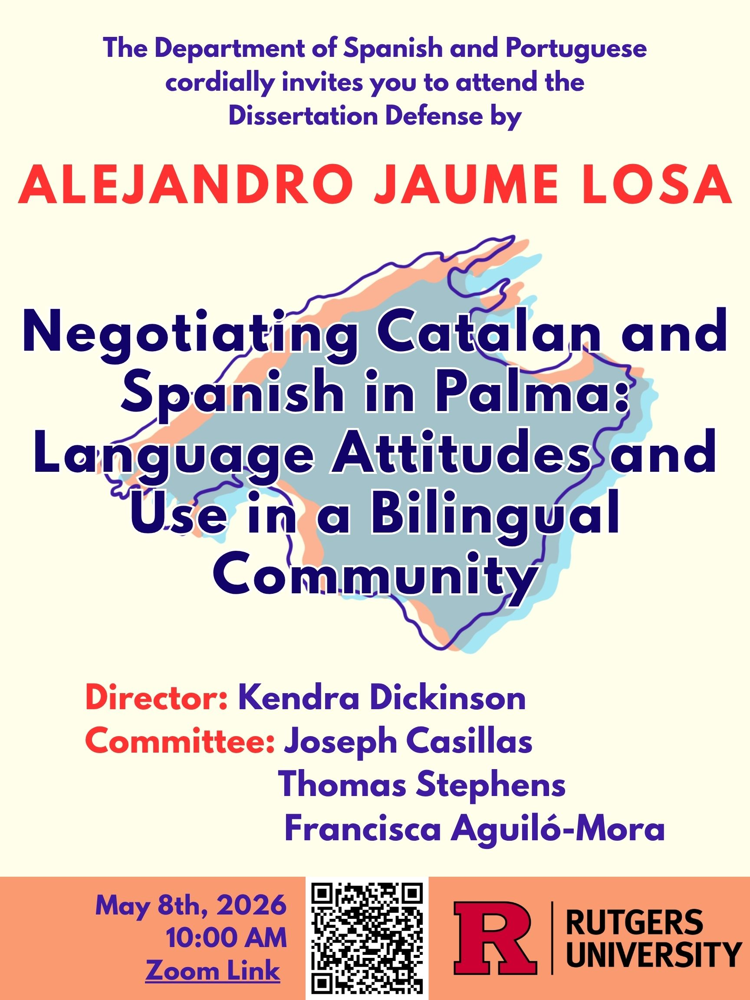

On Friday, May 8th, Alejandro Jaume-Losa successfully defended his dissertation, entitled <em>Negotiating Catalan and Spanish in Palma: Language Attitudes and Use in a Bilingual Community</em>. Alejandro was supported by his committee, including Dissertation Director <a href="https://www.kvdickinson.com">Dr. Kendra V. Dickinson</a>, <a href="https://jvcasillas.com">Dr. Joseph Casillas</a>, and Dr. Tom Stephens, all from Rutgers University, as well as external member Dr. Francisco Aguiló-Mora of Columbia University.

Alejandro’s dissertation examines language attitudes toward and uses of Catalan and Spanish in Palma, the capital of the Balearic Islands, in the context of ongoing social, demographic, and political change. Using a mixed-methods approach, the dissertation combines data from online questionnaires, an Implicit Association Test (IAT), and semi-structured interviews to investigate three main areas: explicit language attitudes, implicit language attitudes, and patterns of language use across different social contexts.

The findings point to a complex sociolinguistic situation in which Catalan has gained greater institutional visibility and higher levels of public knowledge, while its everyday use has continued to decline, especially in Palma, where Spanish increasingly functions as the dominant language of public life. The results also show that sociodemographic factors such as mother tongue, political orientation, education, age, and language proficiency are strongly associated with both language attitudes and language use. Importantly, implicit and explicit attitudes do not always align, nor are they conditioned by the same social factors. More broadly, the dissertation demonstrates that attitudes toward Catalan and Spanish are closely tied to wider debates surrounding identity, tourism, globalization, and linguistic rights in the Balearic Islands. Finally, the dissertation underscores the importance of examining implicit attitudes, explicit attitudes, and language use together, as related but distinct dimensions of behavior and social cognition. By combining quantitative and qualitative data, this study contributes to ongoing research on the relationship between language attitudes, language use, and language policy in bilingual societies undergoing rapid social change.

The committee and audience alike were impressed by the breadth and depth of Alejandro’s work, and we are excited to see what comes next for him.

<strong>Enhorabona, Dr. Jaume-Losa!</strong>

