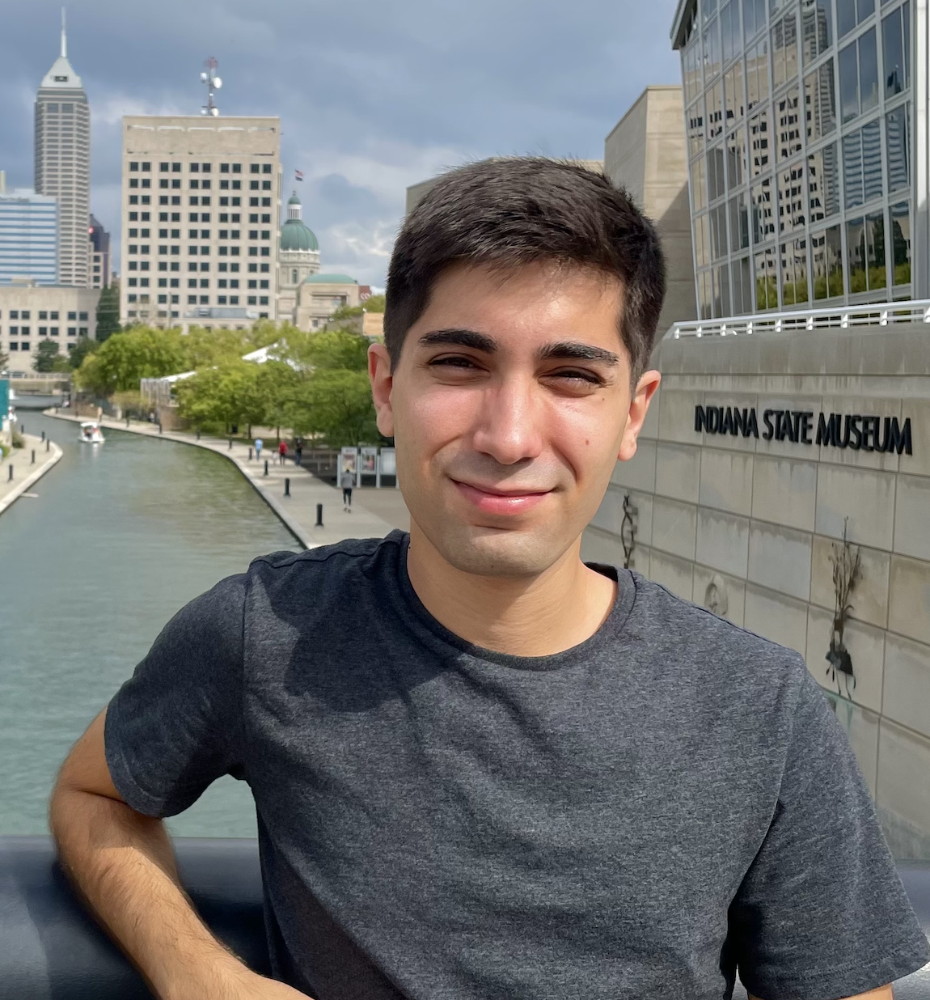
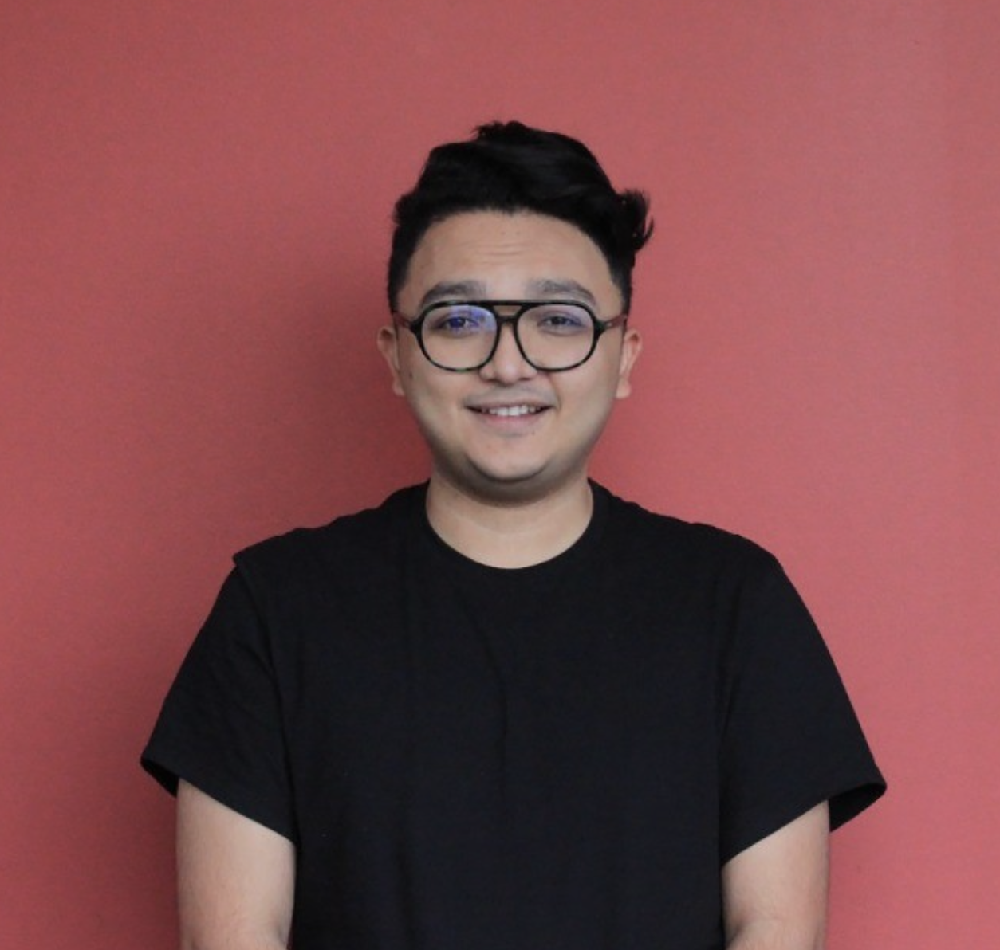
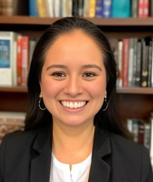
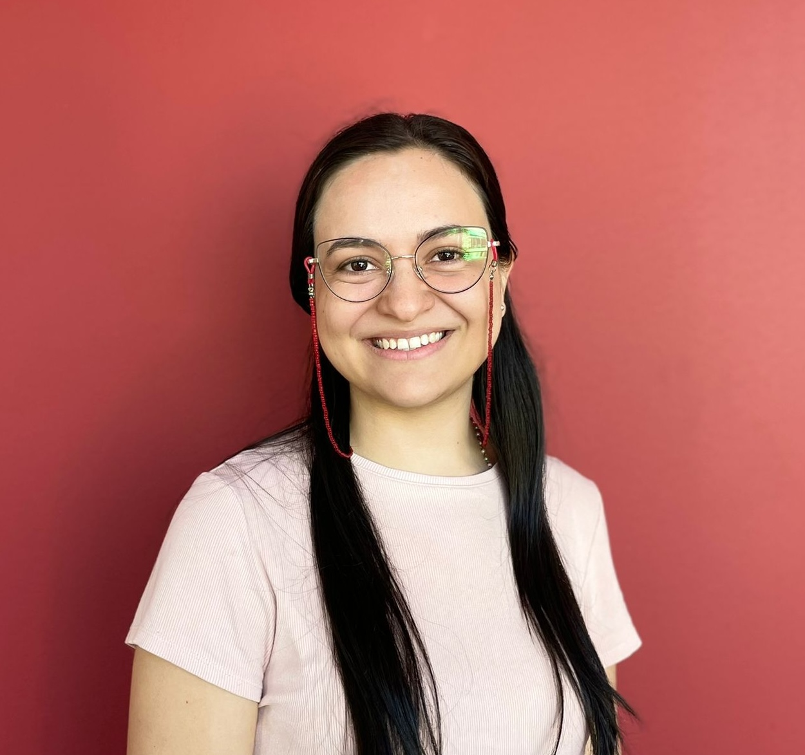
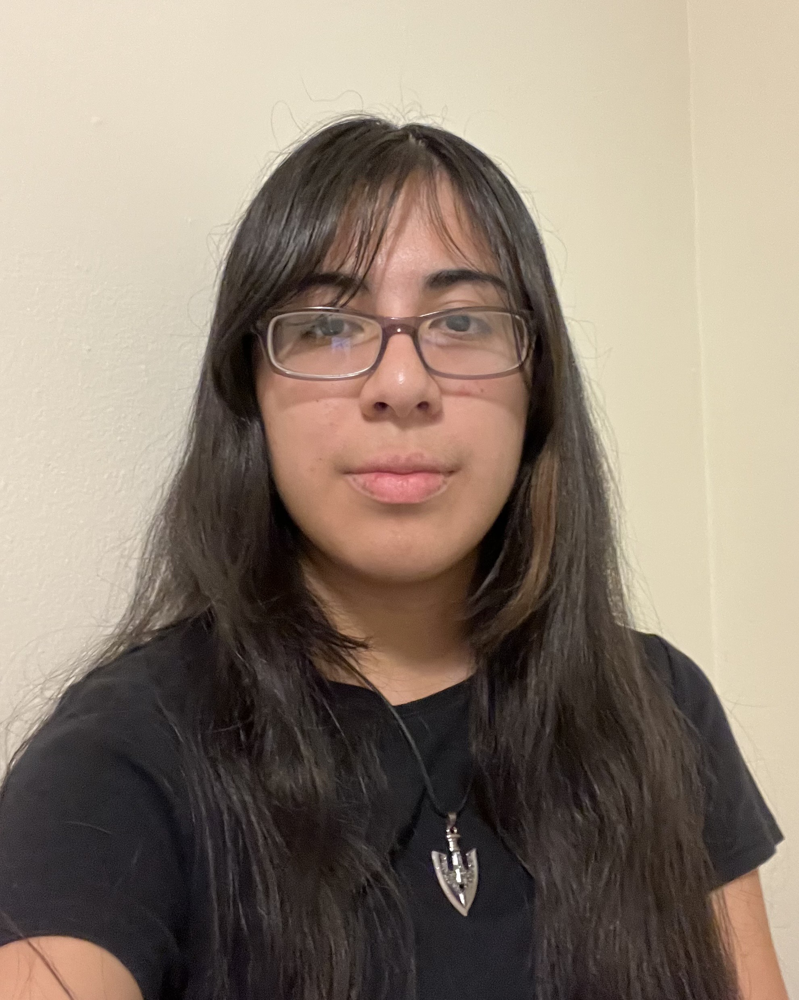

### Current Members

<table style="width: 100%;">
  <tr>
    <td style="width: 180px; padding-right: 20px; vertical-align: top;">
      
    </td>
    <td>
      <strong><a href="https://span-port.rutgers.edu/people/faculty/faculty-directory/1013-kendra-dickinson">Kendra V. Dickinson</a></strong> 
      <i>Principal Investigator</i> 
      Sociolinguistics, Language Variation and Change, Sociolinguistic Perception 
      Brazilian Portuguese, English, Spanish 
      <a href="mailto:kendra.dickinson@rutgers.edu">kendra.dickinson@rutgers.edu</a>
    </td>
  </tr>
</table>

 

<table style="width: 100%;">
  <tr>
    <td style="width: 180px; padding-right: 20px; vertical-align: top;">
      
    </td>
    <td>
      <strong><a href="https://www.mfeliuribas.com">Meritxell Feliu-Ribas</a></strong> 
      <i>PhD Student, Lab Manager</i> 
      Language Variation and Change, Bilingualism, Morphosyntax, Bayesian Data Analysis 
      Catalan, English, German, Russian, Spanish 
      <a href="mailto:mfeliuribas@spanport.rutgers.edu">mfeliuribas@spanport.rutgers.edu</a>
    </td>
  </tr>
</table>

 

<table style="width: 100%;">
  <tr>
    <td style="width: 180px; padding-right: 20px; vertical-align: top;">
      
    </td>
    <td>
      <strong>Alejandro A. Jaume-Losa</strong> 
      <i>PhD Student</i> 
      Language Attitudes, Language Uses, Language Policy 
      Catalan, English, Spanish 
      <a href="mailto:ajaumelosa@rutgers.edu">ajaumelosa@rutgers.edu</a>
    </td>
  </tr>
</table>

 

<table style="width: 100%; border-collapse: collapse;">
  <tr>
    <td style="width: 180px; padding-right: 20px; vertical-align: top;">
      
    </td>
    <td>
      <strong>Yhosep Fernando Barba Blanco</strong> 
      <i>PhD Student</i> 
      Queer Linguistics, Raciolinguistics, Language Attitudes, Linguistic Accommodation, (Critical) Discourse Analysis 
      English, Spanish 
      <a href="mailto:y.barba@rutgers.edu">y.barba@rutgers.edu</a>
    </td>
  </tr>
</table>

 

<table style="width: 100%; border-collapse: collapse;">
  <tr>
    <td style="width: 180px; padding-right: 20px; vertical-align: top;">
      
    </td>
    <td>
      <strong>Diana Sánchez</strong> 
      <i>PhD Student</i> 
      Bilingualism, Autism, Accessibility, Psycholinguistics 
      English, Spanish 
      <a href="mailto:ds1731@rutgers.edu">ds1731@rutgers.edu</a>
    </td>
  </tr>
</table>

 

<table style="width: 100%; border-collapse: collapse;">
  <tr>
    <td style="width: 180px; padding-right: 20px; vertical-align: top;">
      
    </td>
    <td>
      <strong>Luz Valeria Bedoya Cerquera</strong> 
      <i>PhD Student</i> 
      Bilingualism, Pedagogy, Language Attitudes 
      English, French, Portuguese, Spanish 
      <a href="mailto:lb1181@scarletmail.rutgers.edu">lb1181@scarletmail.rutgers.edu</a>
    </td>
  </tr>
</table>

 

<table style="width: 100%;">
  <tr>
    <td style="width: 180px; padding-right: 20px; vertical-align: top;">
      
    </td>
    <td>
      <strong>Eden Calix</strong> 
      <i>Undergraduate Research Assistant</i> 
      English, Spanish 
      <a href="mailto:jdc381@scarletmail.rutgers.edu">jdc381@scarletmail.rutgers.edu</a>
    </td>
  </tr>
</table>

 

### Former Members

* [Gabriella Constantin-Dureci, PhD](https://drexel.edu/teaching-and-learning/about/team-members/constantin-dureci-gabriela)

* Erin Foley, Undergraduate Research Assistant
* Samantha Kozlow, Undergraduate Research Assistant
* Giovanna Licitra, Undergraduate Research Assistant

  

### Collaborators

* [Scott Schwenter](https://sppo.osu.edu/people/schwenter.1), The Ohio State University

* [Mark Hoff](https://www.researchgate.net/profile/Mark-Hoff), Queens College CUNY

* [Ezequiel Durand-López](https://charleston.edu/spanish/faculty/durand-lopez-ezequiel.php), College of Charleston	

* [Nicole Houser](https://www.webster.ac.at), Webster University (Austria)

* [Luana Lamberti](https://language.iastate.edu/directory/luana-lamberti/), Iowa State University